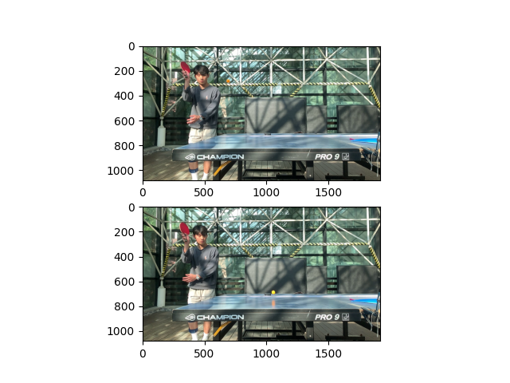
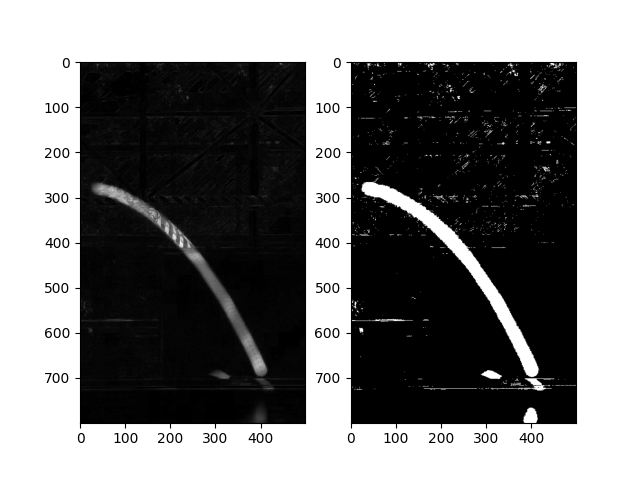
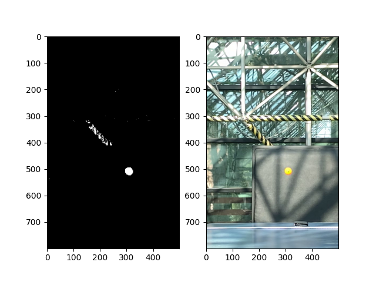
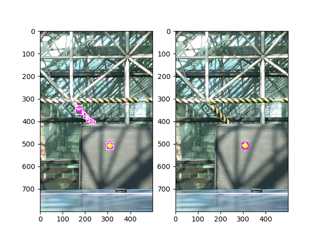

# Ping-pong ball trajectory analysis

## Introduction

Codes provided in this repository are initially built to extract the trajectory of a ping-pong ball from the recorded video. The main idea is as follows :

1)  **Variance of pixels throughout the motion**: RGB values of background pixels would remain the same unless the ping-pong ball coincides the pixel at a moment. Therefore, By thresholding the variance of pixels along the time interval, the trajectory of a ping-pong ball can be extracted.

2)  **Color information of the ping-pong ball**: For an experiment, orange ping-pong ball is used. Hence, using the RGB information of the orange color, among the pixels obtained from 1), the exact area the ball is located at a specific time can be obtained by the inner product between RGB values.

## Results

In *image_process.py*, the illustration of each code blocks were provided. The following is the figures generated along the code.

## Notes

Along the code, there are several features which require manual settings.

-   Start / end frame of the video: In the first

-   Frame of interest:

-   Threshold values (optional) : Depending on the video and purpose, threshold values should be adjusted. Usually, for the fixed experiment situation (fixed background, fixed objects), one or two adjustments would be sufficient.

Don't forget to check if you set the working directory properly.
