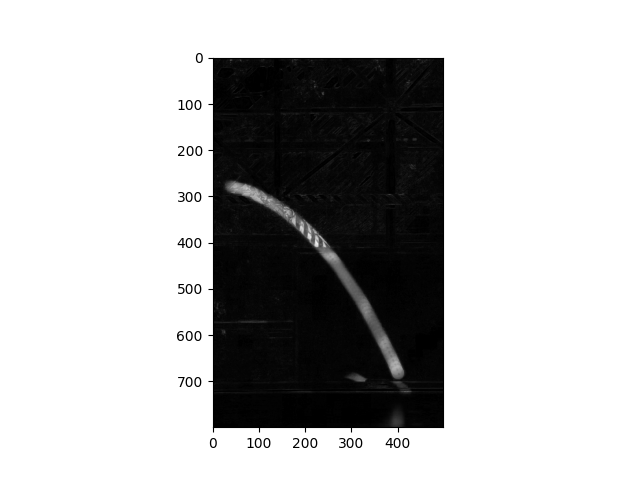
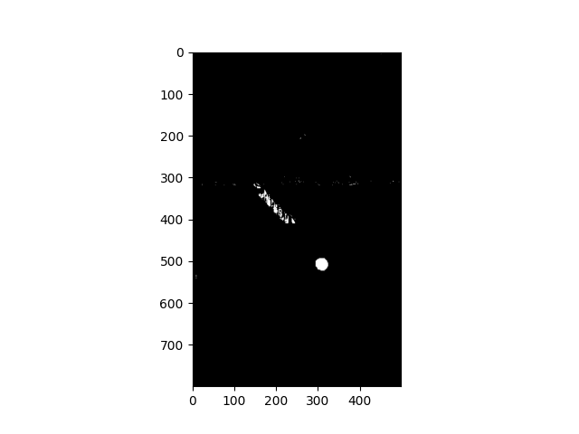
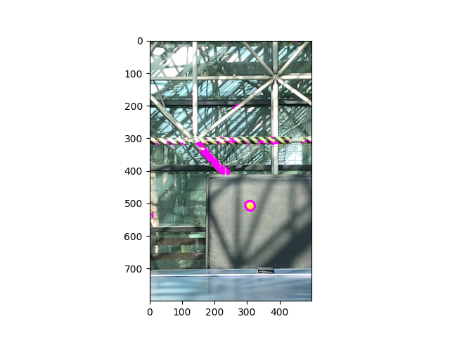

# Pingpong trajectory analysis

Codes provided in this repository are built to extract the trajectory of a pingpong ball from the recorded video. The main idea of the codes are as follows :

1)  Variance of pixels throughout the motion: RGB values of background pixels would remain the same unless the pingpong ball coincides the pixel at a moment. Therefore, By thresholding the variance of pixels along the time interval, the trajectory of a pingpong ball can be extracted.

2)  Color information of the pingpong ball: For an experiment, orange pingpong ball is used. Hence, using the RGB information of the orange color, among the pixels obtained from 1), the exact area that the pingpong ball is located at a specific time can be obtained by the inner product between RGB values.

## Part 1.

## {width="300"}

{width="300"}{width="300"}{width="300"}](Figures/3_Thresholding.png){width="295"}
