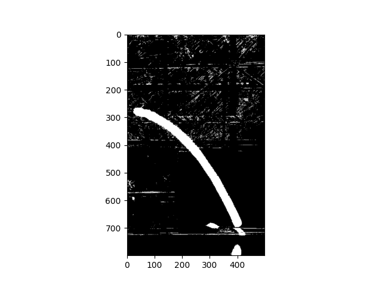
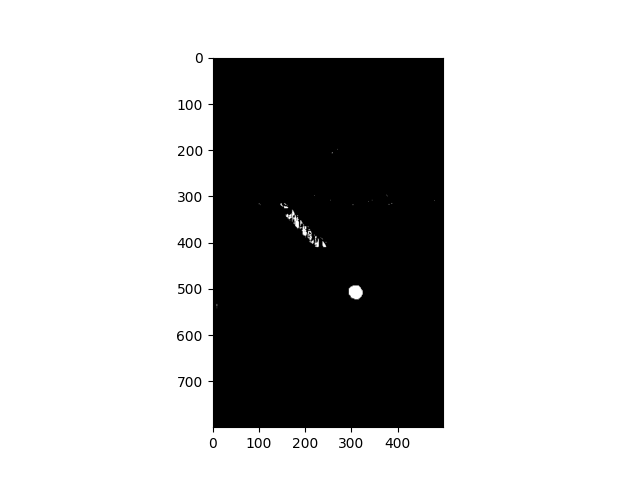
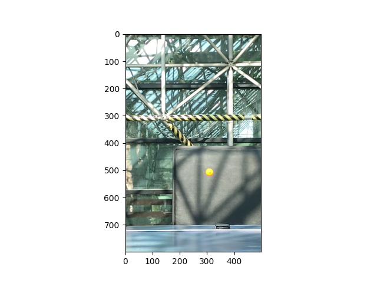
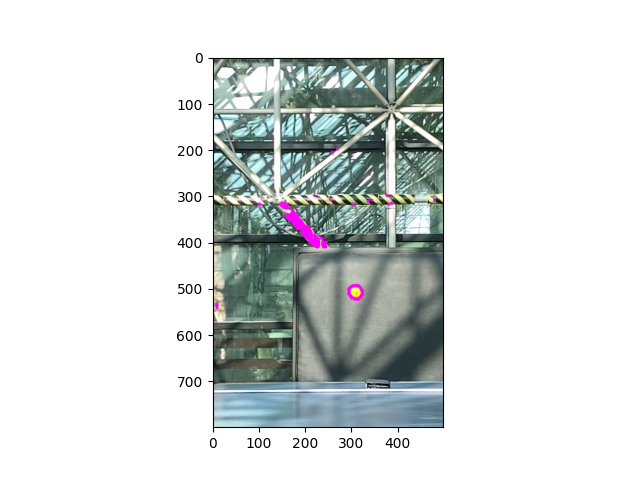
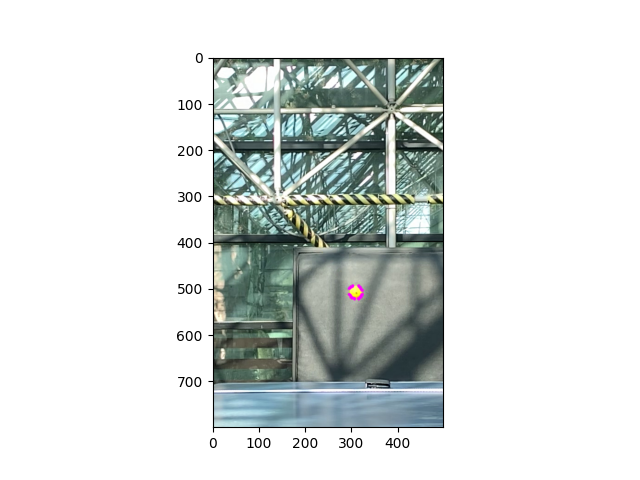

# Ping-pong ball trajectory analysis

------------------------------------------------------------------------

Codes provided in this repository are built to extract the trajectory of a ping-pong ball from the recorded video. The main idea of the codes are as follows :

1)  Variance of pixels throughout the motion: RGB values of background pixels would remain the same unless the ping-pong ball coincides the pixel at a moment. Therefore, By thresholding the variance of pixels along the time interval, the trajectory of a ping-pong ball can be extracted.

2)  Color information of the ping-pong ball: For an experiment, orange ping-pong ball is used. Hence, using the RGB information of the orange color, among the pixels obtained from 1), the exact area the ball is located at a specific time can be obtained by the inner product between RGB values.

    ------------------------------------------------------------------------

| {width="300"}                                                                | {width="295"}                                                                 |
|--------------------------------------------------------------------------------------------------------------------------------------------------------------------------------------------|-----------------------------------------------------------------------------------------------------------------------------------------------------------------|
| {alt="Figure 4. The location of the pingpong ball at a specific frame" width="300"} | {alt="Figure 5. Original image at the selected frame" width="300"} |
| {alt="Figure 6. Extracted contours" width="300"}                                                                                 | {width="300"}                                                                                             |
